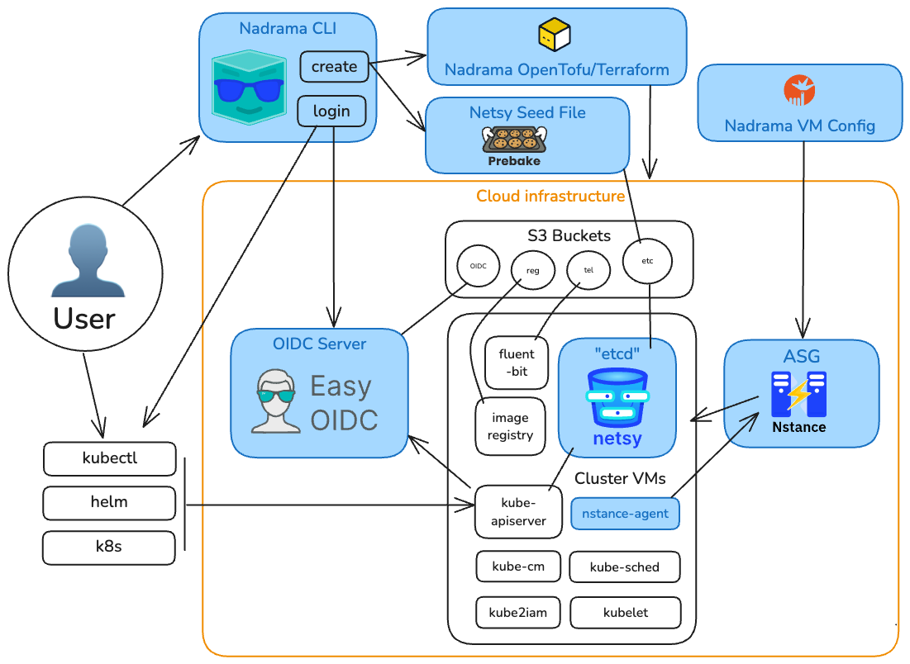

# Talk: Building Nadrama - an Open Source PaaS

This is my talk at the [Melbourne Platform Engineers meetup](https://www.meetup.com/melbourne-pe/) on 3 December 2025 ([event page here](https://www.meetup.com/en-au/melbourne-pe/events/311866081/)).

The goal of the talk is to take you through the journey of building [Nadrama.com](https://nadrama.com) - a container platform you can deploy in minutes, built on Kubernetes.

You can follow and connect with me on [X](https://x.com/ryan0x44) and [LinkedIn](https://www.linkedin.com/in/ryandjurovich/).

---

## 1. July to September Beta

On July 31st, launched a mostly-Open Source solution

e.g. [Netsy](https://netsy.dev) was Open Source already, but you couldn't run the solution entirely yourself.

[Demo of Nadrama.com PaaS offering after July 31st launch](https://drive.google.com/file/d/1g_v4A-ld0EFz356grOsesuxqrDQ5Re2S/view?usp=sharing)

Based on feedback from test users and potential customers, [Nadrama went all-in on Open Source](https://nadrama.com/blog/open-source-paas).

---

## 2. New Platform Design



---

## 3. Open Source PaaS

The current planned DX with the new Nadrama Open Source PaaS:

```
➜ nadrama cluster create production -tf
Generated Terraform/OpenTofu configuration.

➜ tofu apply
Apply complete! Resources: X added, Y changed, Z destroyed.

➜ nadrama cluster login production —api production.example.com —oidc auth.example.com
Awaiting browser login at https://auth.example.com …
Login success! kubectl has now been configured with `production` context.

➜ kubectl get nodes —context production
NAME     STATUS   ROLES          AGE   VERSION
node-1   Ready    control-plane  1m    v1.34.0
node-2   Ready    worker         45s   v1.34.0

➜ nadrama deploy webapp —name hello —image nadrama/hello-world:latest
Success! View your app at https://hello.example.com …
```

---

## 4. The Building Blocks

Let's step through each of the components which make up the "PaaS" solution

---

### PaaS/Apps: Prebake

Status: [Prebake Launched Nov 12](https://nadrama.com/blog/introducing-prebake)

- Overview: <https://prebake.dev>
- Details & Demo: <https://github.com/prebake/prebake?tab=readme-ov-file#prebake---a-developer-platform-for-kubernetes>

```
make kind-create kind-context
kubectl get nodes
kubectl get pods -A
make setup DOMAIN=example.com
make install
kubectl get pods -A
k9s
make kind-delete
```

---

### Auth & RBAC: Easy OIDC

Status: [Easy OIDC Launched Nov 11](https://nadrama.com/blog/introducing-easy-oidc)

- Overview: <https://easy-oidc.dev>
- Dev Demo: <https://github.com/easy-oidc/easy-oidc/blob/main/DEV.md>
- TF Demo: <https://github.com/easy-oidc/terraform-aws-easy-oidc?tab=readme-ov-file#prerequisites>
  - Note: Requires a working Route53 zone

---

### etcd alternative: Netsy

Status: [Single-Node Launched Aug 7](https://nadrama.com/blog/introducing-netsy), TODO - Open Source

---

### Auto-Scaling: Nstance

Status: TODO - Open Source

---

### VM/OS "Images": Nadrama OS

Status: TODO - Open Source

- A collection of userdata scripts which preconfigures operating system with all necessary binaries and configuration
- Exclusively targetting Ubuntu server LTS (why? Cloud provider support, GPU support)
- Skips `apt-get upgrade` on critical path: cache refresh is [often taking 10-15 seconds](https://nadrama.com/blog/infra-in-60-seconds#every-second-counts-and-details-matter) alone.

---

### OpenTofu: Nadrama CLI

Status: TODO - Open Source

- When creating a cluster, you need a name/slug and VPC/Subnet CIDR blocks
- CLI code-gens the OpenTofu variables, etc.

---

## What's Next

* Finish & refine the Open Source solution, then get more folks using it, and iterate

* Build a new SaaS offering which deploys the Open Source platform, managed for you

---

## Other Things

Over the last two months have used Claude Code, Codex, and AmpCode, using Claude Sonnet/Opus 4(.5), GPT5, and Gemini 3.

Currently the main tools are VSCodium and Ghostty+tmux with Amp Code and Opus 4.5.

---

## Takeaways

If you want:

* An OIDC server for Kubernetes that's fast to set-up and low cost/maintenance: check out [Easy OIDC](https://easy-oidc.dev)!

* etcd but without the operational complexity: check out [Netsy](https://netsy.dev) (multi-node coming soon!)

* Fast auto-scaling VMs with custom CA certificates (with or without Kubernetes): check out [Nstance](https://nstance.dev)

* A developer platform deployed on a Kubernetes cluster in two commands: check out [Prebake](https://prebake.dev)

* An Open Source Kubernetes PaaS, follow [Nadrama on LinkedIn](https://www.linkedin.com/company/nadrama/) for updates, or join the [Nadrama Discord community](https://go.nadrama.com/discord) - Nadrama is launching soon.

---

## Show Your Support

😎 Take some swag

⭐ Please star the GitHub repo's:

* [Easy OIDC](https://github.com/easy-oidc/easy-oidc)
* TODO: Nstance
* [Netsy](https://github.com/nadrama-com/netsy)
* [Prebake](https://github.com/prebake/prebake)

🗣️ Join the community and ask questions / give feedback / contribute:

* [Nadrama Discord community](https://go.nadrama.com/discord)

---

Thank you!